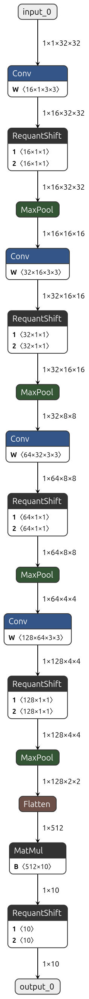

# Deeploy Model Inspection Notes

**Date:** March 11 2026

---

## Progress Summary

### 1. Running Deeploy test workloads

Deeploy's test framework was used to generate inference code for the **Siracusa + RedMulE platform**.

Example run command:

```bash
cd DeeployTest
source /app/install/pulp-sdk/configs/siracusa.sh

python testRunner_tiled_siracusa_w_redmule.py -t Tests/simpleCNN --cores=8
```

Successful runs generate the following artifacts:

```
TEST_SIRACUSA_W_REDMULE/
└── Tests
    └── simpleCNN
        ├── Network.c
        ├── Network.h
        ├── testinputs.h
        ├── testoutputs.h
        └── deeployStates/
```

`Network.c` contains the generated runtime code for executing the network on the target platform.
Matrix multiplication operations are mapped to the **RedMulE accelerator**.

Example generated kernel call:

```c
Gemm_fp32_fp32_fp32_fp32_Redmule(...)
```

---

### 2. Inspecting intermediate ONNX graphs

During compilation, Deeploy exports intermediate ONNX graphs representing different stages of the compilation pipeline.

These are stored in:

```
deeployStates/
```

Example files:

```
middleware_pre_lowering.onnx
middleware_post_lowering.onnx
backend_post_parsing.onnx
backend_post_binding.onnx
```

The **`middleware_pre_lowering.onnx`** graph was visualized using **Netron**, as it most closely represents the original network structure.

Example command:

```bash
netron middleware_pre_lowering.onnx
```

---

### 3. Example model: `simpleCNN`

The ONNX graph for the `simpleCNN` test network is shown below.



Network structure:

```
Input (1×32×32)

Conv (16 filters)
→ RequantShift
→ MaxPool

Conv (32 filters)
→ RequantShift
→ MaxPool

Conv (64 filters)
→ RequantShift
→ MaxPool

Conv (128 filters)
→ RequantShift
→ MaxPool

Flatten

MatMul (512 → 10)

RequantShift

Output
```

The final **MatMul layer** is expected to be executed on the **RedMulE GEMM accelerator**.

---

## Current Status

The compiler pipeline is successfully generating runtime code from ONNX models and mapping GEMM operations to RedMulE.

---

## Next Steps

* Run generated workloads using **RedMulE**
* Measure accelerator latency
* Prepare larger models (e.g., basecalling networks) for evaluation.
